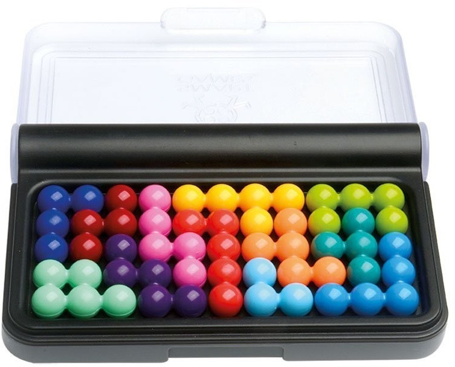
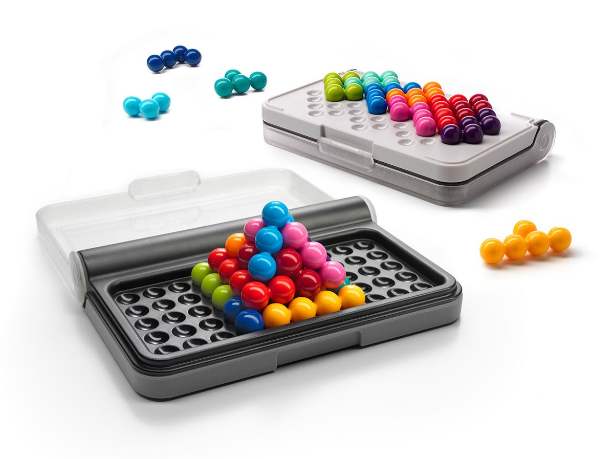

# IQpuzzler
Finds all solutions for IQ Puzzler game (https://www.smartgames.eu/uk/one-player-games/iq-puzzler-pro) with backtracking algorithm, implemented in C++. There are three versions of the game:
<ul>
  <li><code>IQpuzzler_rect</code> solves the 2D 11x5 rectangular board.</li>
  <li><code>IQpuzzler_diag</code> solves the 2D diagonal arrangement.</li>
  <li><code>IQpuzzler_pyra</code> solves the 3D pyramid.</li>
</ul>

Part definitions and orientations are read from a text file <code> *.2di</code> (for the 2D games) or <code> *.3di</code> (for the 3D game) which has to be located in the same folder as the executable (e.g. in the <code>bin</code> folder).

The input filename (without extension) is provided in the command line argument. If no argument is provided, <code>orig</code> is used as default input file, using the 12 parts from the original game. Besides <code>orig</code>, some other configurations with 11 parts (<code>cross</code>, <code>long</code>) are provided. 

Expected input format is a list of parts (separated by <code>,</code>), where each part is a list of orientations ( start of list with <code>[</code>, end of list with <code>]</code>), where each orientation is a list of dots (logically same number of dots within same part, usually 3 to 5, depending on part size), where each dot is a list of coordinates (single digit, non-negative integers, x, y, optional z for 3D puzzle), defining the possible geometric orientations of each dot of the parts.
Thus, the text in the file can also be used directly in Python or C++ (replace <code>[ ]</code> by <code>{ }</code>) to initialize lists or vector arrays.

No checks are performed to verify correctness of the data (except counting the number of parts).
Wrong data or format will lead to undefined behaviour of the read functions or the solution algorithm.
Characters other than <code>[</code> (begin of list), <code>]</code> (end of list), <code>,</code> (separator) or single digits will be ignored and can be used for comments.
Input files can be created automatically with the provided MATLAB / OCTAVE tool (see folder <code>pre-processing</code>) for different game configurations (e.g. original IQpuzzlerPRO game).

Symmetric or rotated solutions can be avoided by reducing the orientations of a particular part.

As output, the program creates a text file <code> *.2do</code> (for the 2D games) or <code> *.3do</code> (for the 3D game) in the same folder as the executable with solutions and timestamps (parts are represented as <code>A</code>,<code>B</code>,<code>C</code>,...). Existing files with the same name will be overwritten without further notification, so please make sure to copy those output files you want to keep to a different folder (e.g. <code>solutions</code>).
A real time visualization of the current search and identified solutions is printed to the terminal window.
The search algorithm is accelerated by identification of isolated cavities before going into new recursions. For the 3D puzzle, this reduces execution time by 90%, without losing any solutions.

With the original game configuration, <b>1.082.785</b> solutions have been found for the 2D rectangular board, <b>344.100</b> solutions for the 2D diagonal board, and <b>4.360</b> solutions for the 3D pyramid. Symmetric or rotated solutions have not been counted by reducing symmetric or rotated orientations of single parts.

No solutions have been found for the 3D pyramid using configurations with 11 parts (e.g. <code>cross</code>, <code>long</code>).

Start (with some examples for different games and configurations):<pre><code>
  git clone https://github.com/deverw/IQpuzzler
  cd IQpuzzler
  make
  cd bin
  ./IQpuzzler_rect
  ./IQpuzzler_rect cross
  ./IQpuzzler_diag
  ./IQpuzzler_diag long
  ./IQpuzzler_pyra</code></pre>
